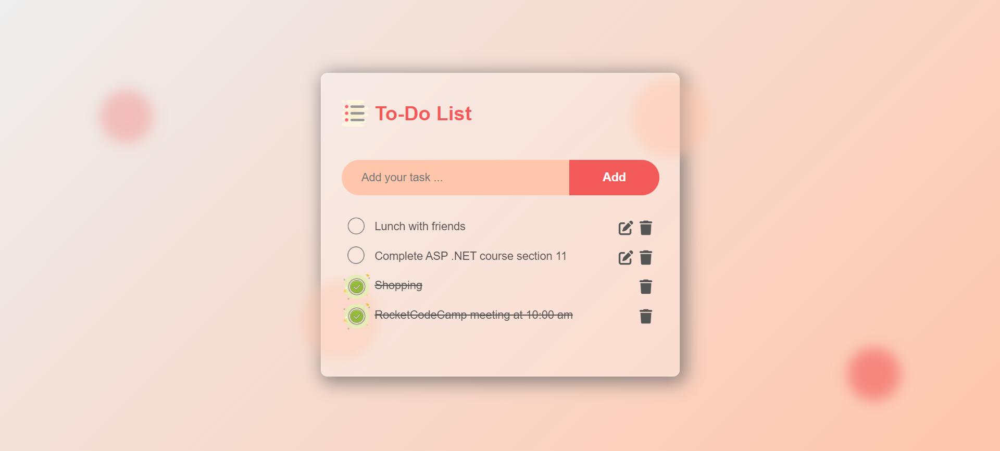

# To Do List Application

A utility designed to streamline your daily routine, the to-do list consists of individual tasks displayed on separate lines, each accompanied by a clickable checkbox. Easily mark tasks as complete or incomplete by selecting or deselecting the checkboxes.

### Built With

I have built this project using the following tools & techniques:HTML,CSS and JavaScript.

Key Features:
```
The data is being saved and retrieved from the Local Storage which means the data is not lost even after the page refresh.
Add a new task.
Delete single task.
Edit single task.
Delete completed tasks.
Mark task as completed / uncompleted.
New tasks are added at the top of the list for better visibility.
Completed tasks are moved to the end of the list.
```

## Result




